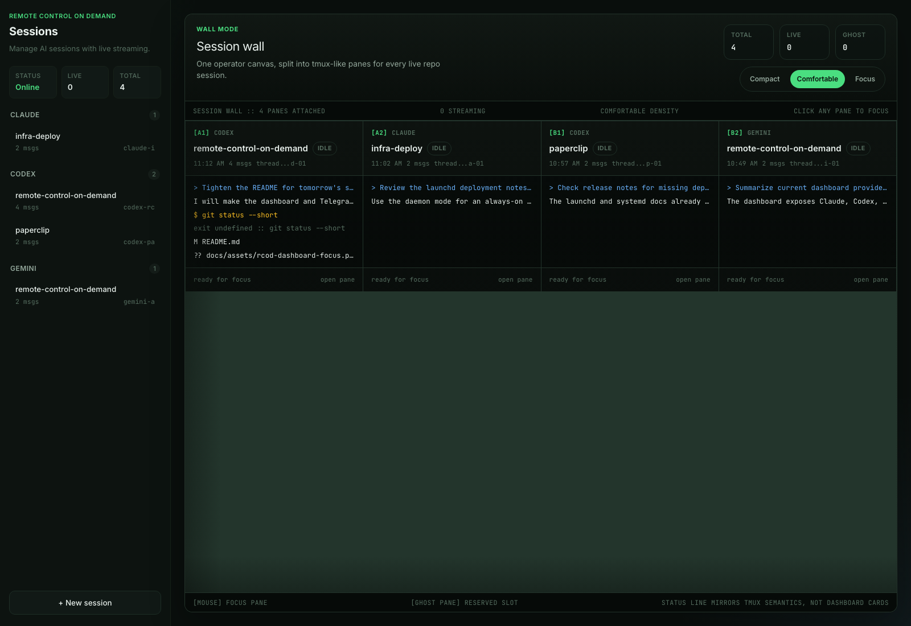
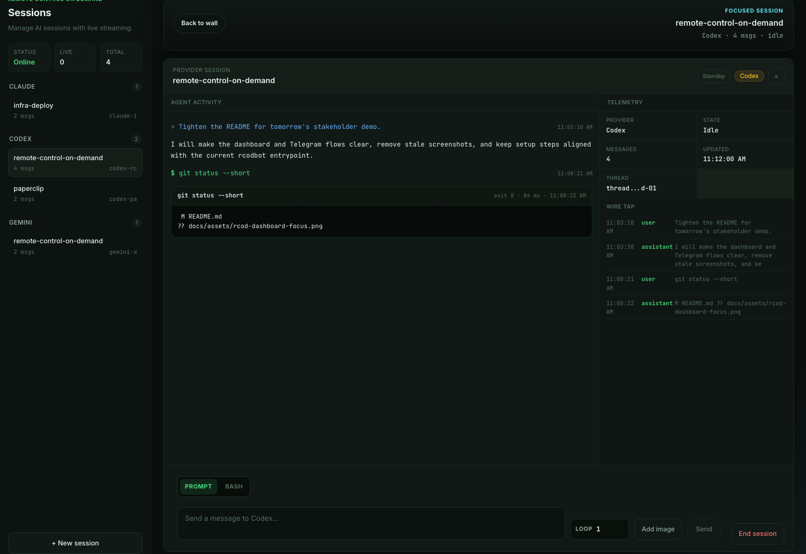
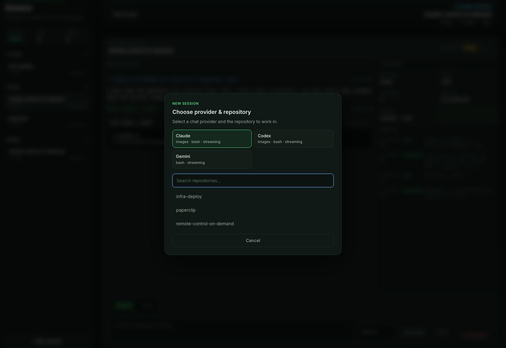

# RCOD: Remote Control On Demand

[](https://github.com/zevro-ai/remote-control-on-demand/actions/workflows/build.yml)
[](https://github.com/zevro-ai/remote-control-on-demand/actions/workflows/release.yml)
[](./LICENSE)

RCOD is an operator console for AI coding sessions. It runs on your machine or server, discovers git repositories under one base folder, and gives you two control surfaces:

- a web dashboard with a live session wall, focused agent view, prompt and bash composer, telemetry, and provider-aware session management
- a Telegram bot for starting Claude remote-control sessions, checking logs/status, and chatting with Codex or Gemini from your phone

Built by [zevro.ai](https://zevro.ai).



## Current Dashboard

The dashboard is served by the `cmd/rcodbot` binary when `api.port` is enabled.

| Session focus | New session picker |
| --- | --- |
|  |  |

## What RCOD Does

- Shows all active chat sessions in a tmux-like session wall
- Opens a focused session view with agent activity, telemetry, wire tap, and message history
- Sends prompts to configured chat providers from the browser
- Runs bash commands in the selected repository from the focused dashboard session
- Supports image attachments for providers that expose image support
- Creates new chat sessions by provider and repository
- Adopts existing Codex sessions from local Codex state
- Streams updates through WebSocket so the dashboard stays live
- Starts, stops, restarts, and monitors long-running `claude rc` remote-control sessions
- Sends Claude URLs, status, logs, crash notifications, and progress heartbeats to Telegram
- Keeps runtime state in JSON files so sessions can be restored after restart

## Providers

| Provider | Surface | Notes |
| --- | --- | --- |
| Claude runtime | Telegram + API | Long-running `claude rc` process control with URL detection, logs, auto-restart, and per-project `.rcod.yaml` overrides |
| Claude chat | Dashboard | Repository-scoped chat sessions backed by the Claude CLI |
| Codex chat | Dashboard + Telegram | Repository-scoped chat sessions, streaming output, tool calls, bash command execution, image attachments, and adoption of existing Codex threads |
| Gemini chat | Dashboard + Telegram | Optional provider for Gemini CLI sessions; enable it with `providers.gemini.enabled: true` |

`cmd/rcodbot` is the current main entrypoint. The older `cmd/bot` entrypoint is a narrower Telegram-only Claude runtime bot.

## Prerequisites

| Requirement | Notes |
| --- | --- |
| Go 1.25.6+ | Needed when building from source |
| Node.js + npm | Needed to build the React dashboard assets |
| Claude Code CLI | Required for Claude runtime and Claude chat flows |
| Codex CLI | Required for Codex chat flows |
| Gemini CLI | Optional; only needed when Gemini is enabled |
| Telegram bot token | Create one via [@BotFather](https://t.me/BotFather) |
| Telegram user ID | Get it from [@userinfobot](https://t.me/userinfobot) |

The CLIs you enable must be available in the runtime user's `PATH`.

## Quick Start

```bash
git clone https://github.com/zevro-ai/remote-control-on-demand.git
cd remote-control-on-demand

make build
cp config.example.yaml config.yaml
# edit config.yaml
./rcod --config config.yaml
```

Manual build commands:

```bash
cd app && npm ci && npm run build && cd ..
go build -o rcod ./cmd/rcodbot
```

If `config.yaml` is missing, RCOD starts an interactive onboarding flow and writes a local config file with mode `0600`.

When `api.port` is enabled, open:

```text
http://localhost:8080
```

Adjust the port to match your config.

## Configuration

Minimal `config.yaml`:

```yaml
telegram:
  token: "YOUR_BOT_TOKEN"
  allowed_user_id: 123456789

api:
  port: 8080
  token: "replace-with-a-local-api-token"

rc:
  base_folder: "/home/user/Projects"

providers:
  claude:
    chat:
      permission_mode: "workspace-write"
    runtime:
      auto_restart: true
      max_restarts: 3
      restart_delay_seconds: 5
  codex:
    chat:
      permission_mode: "workspace-write"
  gemini:
    enabled: false
    chat:
      permission_mode: "auto_edit"
```

See [config.example.yaml](./config.example.yaml) for a fuller example with notification patterns and external dashboard auth.

### Dashboard Auth

The dashboard/API supports:

- no API auth when `api.port` is enabled without `api.token` or `api.auth`
- bearer token auth with `api.token`
- external browser login with `api.auth`, using either generic OIDC or GitHub OAuth

External auth uses an RCOD-managed session cookie after login. Browser API calls and WebSocket connections reuse that cookie automatically. Token auth remains available for scripts and can also stay enabled alongside external auth.

External auth requires:

- `api.auth.session_secret` with at least 32 random characters
- exactly one provider under `api.auth.oidc` or `api.auth.github`
- a callback URL pointing back to RCOD, usually `https://your-host/api/auth/callback`

Example OIDC/Authentik-style config:

```yaml
api:
  port: 8080
  auth:
    session_secret: "replace-with-at-least-32-random-characters"
    oidc:
      issuer_url: "https://auth.example.com/application/o/rcod/"
      client_id: "rcod"
      client_secret: "replace-me"
      redirect_url: "https://rcod.example.com/api/auth/callback"
      scopes: ["openid", "profile", "email"]
      allowed_emails:
        - "you@example.com"
      allowed_groups:
        - "rcod-admins"
```

Example GitHub config:

```yaml
api:
  port: 8080
  auth:
    session_secret: "replace-with-at-least-32-random-characters"
    github:
      client_id: "Iv1.xxxxx"
      client_secret: "replace-me"
      redirect_url: "https://rcod.example.com/api/auth/callback"
      allowed_users:
        - "octocat"
      allowed_orgs:
        - "zevro-ai"
```

### Important Fields

| Field | Description |
| --- | --- |
| `telegram.token` | Bot token from @BotFather |
| `telegram.allowed_user_id` | Only this Telegram user can control the bot |
| `api.port` | Enables the HTTP dashboard/API when greater than `0` |
| `api.token` | Optional bearer token for API clients and dashboard access |
| `api.auth.session_secret` | Required for external dashboard sessions |
| `api.auth.oidc.*` | Generic OIDC provider config for Authentik and similar providers |
| `api.auth.github.*` | GitHub OAuth config for external dashboard login |
| `rc.base_folder` | Directory RCOD scans for git repositories |
| `providers.claude.runtime.*` | Claude runtime restart and notification settings |
| `providers.claude.chat.permission_mode` | Claude chat permission mode |
| `providers.codex.chat.permission_mode` | Codex chat access mode: `workspace-write`, `read-only`, `danger-full-access`, or `bypassPermissions` |
| `providers.gemini.enabled` | Enables the Gemini chat provider |
| `providers.gemini.chat.permission_mode` | Gemini permission mode: `auto_edit`, `plan`, `yolo`, `read-only`, `workspace-write`, `danger-full-access`, or `bypassPermissions` |

RCOD intentionally starts Claude runtime sessions with `claude rc --permission-mode bypassPermissions`. This is not configurable for the runtime process.

Legacy `rc.permission_mode`, `rc.auto_restart`, `rc.max_restarts`, `rc.restart_delay_seconds`, and `rc.notifications` are still accepted as fallbacks for older configs.

### Per-Project Overrides

Create `.rcod.yaml` inside a repository under `rc.base_folder` to override Claude runtime defaults for that project:

```yaml
auto_restart:
  enabled: true
  max_attempts: 5
  delay: 10s
prompt: "Focus on triaging open issues first"
max_duration: 2h
notifications:
  progress_update_interval: 10m
  idle_timeout: 10m
  patterns:
    - name: "task_completed"
      regex: "(?i)(task completed|all done)"
      once: true
```

## Telegram Commands

Claude runtime control:

| Command | Description |
| --- | --- |
| `/start [repo]` | Start a `claude rc` runtime session |
| `/folders` | Browse repositories for Claude runtime sessions |
| `/list` | List active Claude runtime sessions |
| `/status [id]` | Show folder, PID, uptime, restart count, and Claude URL |
| `/logs [id]` | Show recent Claude runtime logs |
| `/restart [id]` | Restart a Claude runtime session |
| `/kill [id]` | Stop a Claude runtime session |

Chat control:

| Command | Description |
| --- | --- |
| `/new [repo]` | Create a Codex or Gemini chat session |
| `/sessions` | List chat sessions |
| `/use [provider:id]` | Switch the active chat session |
| `/current` | Show active chat sessions |
| `/close [provider:id]` | Close a chat session |
| normal text | Send a message to the active chat provider |
| `/help` | Show bot help |

Direct repository arguments resolve exact matches first, then unique partial matches. Ambiguous matches are rejected and shown back to you.

## Runtime State

Use `--state-dir` to keep mutable state separate from config:

```bash
./rcod --config /etc/rcod/config.yaml --state-dir /var/lib/rcod
```

Common state files:

- `sessions.json` for Claude runtime sessions
- `claude_sessions.json` for Claude chat sessions
- `codex_sessions.json` for Codex chat sessions
- `gemini_sessions.json` for Gemini chat sessions
- `bot_state.json` for Telegram bot selection state

## Deployment

RCOD supports:

- Debian/Ubuntu `.deb` packages
- Debian/Ubuntu `systemd` system services and user services
- macOS `launchd` LaunchDaemons and LaunchAgents

Start with:

- [docs/deployment/deb.md](./docs/deployment/deb.md)
- [docs/deployment/systemd.md](./docs/deployment/systemd.md)
- [docs/deployment/launchd.md](./docs/deployment/launchd.md)

Templates and helpers:

- [packaging/systemd/rcod.service](./packaging/systemd/rcod.service)
- [packaging/systemd/rcod.user.service](./packaging/systemd/rcod.user.service)
- [packaging/launchd/ai.zevro.rcod.plist](./packaging/launchd/ai.zevro.rcod.plist)
- [packaging/launchd/ai.zevro.rcod.agent.plist](./packaging/launchd/ai.zevro.rcod.agent.plist)
- [scripts/install-rcod-systemd.sh](./scripts/install-rcod-systemd.sh)
- [scripts/install-rcod-launchd.sh](./scripts/install-rcod-launchd.sh)

## Development

```bash
make build
make test
make vet
make fmt
```

Equivalent commands without `make`:

```bash
cd app && npm ci && npm test && npm run build && cd ..
go build -o rcod ./cmd/rcodbot
go test ./...
go vet ./...
gofmt -w cmd internal
```

## Security Notes

- `config.yaml` contains secrets and should stay local
- `api.token`, `api.auth.session_secret`, OIDC client secrets, and GitHub client secrets should be treated like credentials
- Only `telegram.allowed_user_id` can control the Telegram bot
- Dashboard/API auth can be enforced with `api.token` or an external provider under `api.auth`
- Child processes inherit the runtime user's account permissions
- `bypassPermissions` and `danger-full-access` should only be used on machines and repositories where that access is intended
- RCOD strips Claude session environment variables before spawning nested `claude rc` runtime processes

See [SECURITY.md](./SECURITY.md) for reporting guidance.

## Contributing

See [CONTRIBUTING.md](./CONTRIBUTING.md).

## License

[Apache 2.0](./LICENSE)
