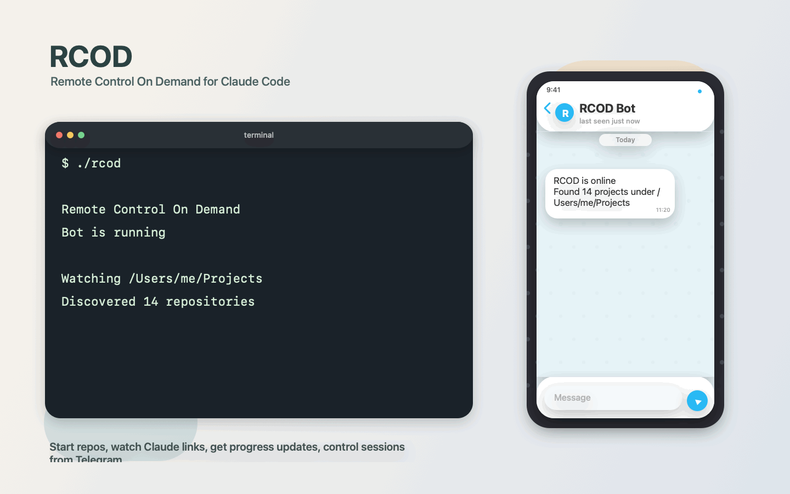

# RCOD: Remote Control On Demand

[](https://github.com/zevro-ai/remote-control-on-demand/actions/workflows/build.yml)
[](https://github.com/zevro-ai/remote-control-on-demand/actions/workflows/release.yml)
[](./LICENSE)

Manage [Claude Code](https://docs.anthropic.com/en/docs/claude-code) sessions remotely via Telegram. RCOD runs on your machine or server, starts `claude rc` inside selected git repositories, and sends status, logs, crashes, and Claude session links back to your phone.

Built by [zevro.ai](https://zevro.ai).



## What RCOD Does

- Starts and stops `claude rc` sessions from Telegram
- Recursively discovers repositories under a configured projects folder
- Streams Claude session URLs and selected output events back to Telegram
- Sends periodic progress heartbeats on long-running sessions
- Restarts crashed sessions automatically when configured
- Applies per-project overrides from `.rcod.yaml`
- Adds inline Telegram actions for status, logs, restart, stop, and Claude links
- Paginates repository pickers and supports unique partial project matches
- Always launches Claude with `--permission-mode bypassPermissions`

## How It Works

```text
You (Telegram) -> RCOD bot -> claude rc (inside your git repo)
       <- status, logs, Claude link <-
```

## Prerequisites

| Requirement | Notes |
| --- | --- |
| Go 1.25+ | Needed only when building from source |
| Claude Code CLI | Install with `npm install -g @anthropic-ai/claude-code` |
| Telegram bot token | Create one via [@BotFather](https://t.me/BotFather) |
| Telegram user ID | Get it from [@userinfobot](https://t.me/userinfobot) |

`claude` must be available in your `PATH`.

## Quick Start

```bash
git clone https://github.com/zevro-ai/remote-control-on-demand.git
cd remote-control-on-demand
go build -o rcod ./cmd/bot
./rcod
```

If `config.yaml` is missing, RCOD starts an interactive onboarding flow and writes a local config file with mode `0600`.

## Why It Feels Good

- no SSH session needed just to check whether Claude is still working
- Telegram becomes the remote control surface, not a dumb notifier
- long sessions keep sending heartbeats, so you know work is still moving
- inline actions make restart, logs, and stop a two-tap flow

## Configuration

Minimal `config.yaml`:

```yaml
telegram:
  token: "YOUR_BOT_TOKEN"
  allowed_user_id: 123456789

rc:
  base_folder: "/home/user/Projects"
  auto_restart: true
  max_restarts: 3
  restart_delay_seconds: 5
```

See [config.example.yaml](./config.example.yaml) for a fuller example with notifications.

### Global Config Fields

| Field | Description |
| --- | --- |
| `telegram.token` | Bot token from @BotFather |
| `telegram.allowed_user_id` | Only this Telegram user can control the bot |
| `rc.base_folder` | Directory RCOD scans for git repositories |
| `rc.auto_restart` | Enables automatic restart for crashed sessions |
| `rc.max_restarts` | Maximum restart attempts before giving up |
| `rc.restart_delay_seconds` | Delay between restart attempts |
| `rc.notifications.progress_update_interval` | Optional progress heartbeat interval, for example `10m` |
| `rc.notifications.idle_timeout` | Optional idle notification threshold |
| `rc.notifications.patterns` | Optional regex-based output notifications |

RCOD intentionally always starts Claude with `claude rc --permission-mode bypassPermissions`. This is not configurable.

### Per-Project Overrides

Create `.rcod.yaml` inside a repository under `rc.base_folder` to override defaults for that project:

```yaml
auto_restart:
  enabled: true
  max_attempts: 5
  delay: 10s
prompt: "Focus on triaging open issues first"
max_duration: 2h
notifications:
  progress_update_interval: 10m
  idle_timeout: 10m
  patterns:
    - name: "task_completed"
      regex: "(?i)(task completed|all done)"
      once: true
```

| Field | Description |
| --- | --- |
| `auto_restart.enabled` | Override global auto-restart for this project |
| `auto_restart.max_attempts` | Override restart limit |
| `auto_restart.delay` | Override restart delay, for example `30s` or `1m` |
| `prompt` | Extra project-specific context shown when the session starts |
| `max_duration` | Kill the session after a fixed duration |
| `notifications.*` | Override global notification settings for this project |

### Folder Resolution

RCOD only starts repositories that resolve inside `rc.base_folder`. Direct command arguments such as `/start team/api` are allowed, but path traversal outside the configured base folder is rejected.

## Telegram Commands

| Command | Description |
| --- | --- |
| `/start` | Start a session from the discovered repository list |
| `/kill` | Stop a running session |
| `/status` | Show folder, PID, uptime, and restart count |
| `/logs` | Show the last 50 log lines |
| `/restart` | Restart a session |
| `/list` | List active sessions |
| `/folders` | Browse available repositories |
| `/help` | Show command help |

Commands also accept direct arguments, for example `/start my-project` or `/kill a1b2`. `/start` resolves exact matches first, then unique partial matches.

## Running as a Service

Service templates live in [packaging/systemd/rcod.service](./packaging/systemd/rcod.service) and [packaging/launchd/ai.zevro.rcod.plist](./packaging/launchd/ai.zevro.rcod.plist). Replace the placeholder paths with your own values before installing them.

## Session Persistence

RCOD automatically saves the state of all active sessions to a `sessions.json` file (located in the same directory as your `config.yaml`). 

- **Bot Restarts:** If the bot is restarted (e.g., during an update or system reboot), it will automatically re-attach to any `claude rc` processes that are still running.
- **URL Recovery:** Upon re-attaching, the bot re-sends the original `claude.ai` session link to Telegram so you can resume work immediately.
- **Orphan Monitoring:** The bot continues to monitor these "orphaned" processes and will notify you if they eventually exit or crash.

## Development

```bash
make build
make test
make vet
make fmt
```

If you do not use `make`, the equivalent commands are:

```bash
go build -o rcod ./cmd/bot
go test ./...
go vet ./...
gofmt -w cmd internal
```

## Security Notes

- `config.yaml` contains your Telegram bot token and should stay local
- Only `telegram.allowed_user_id` can control the bot
- Child processes inherit your user account permissions
- RCOD strips Claude session environment variables before spawning nested `claude rc` processes

See [SECURITY.md](./SECURITY.md) for reporting guidance.

## Contributing

See [CONTRIBUTING.md](./CONTRIBUTING.md).

## Assets

- [Demo GIF](./docs/assets/rcod-demo.gif)
- [GIF renderer](./scripts/render_demo_gif.swift)

## License

[Apache 2.0](./LICENSE)
